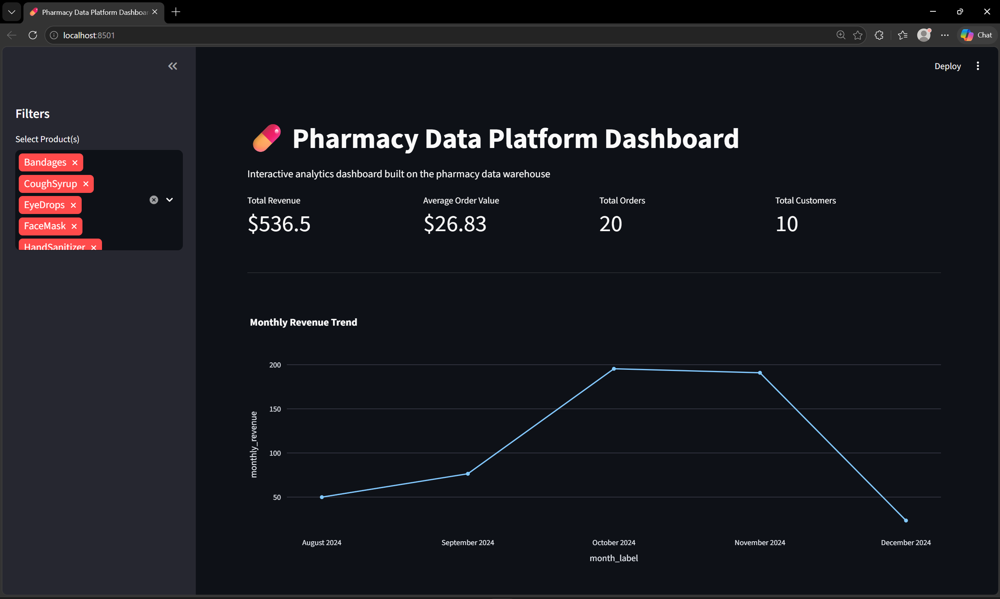
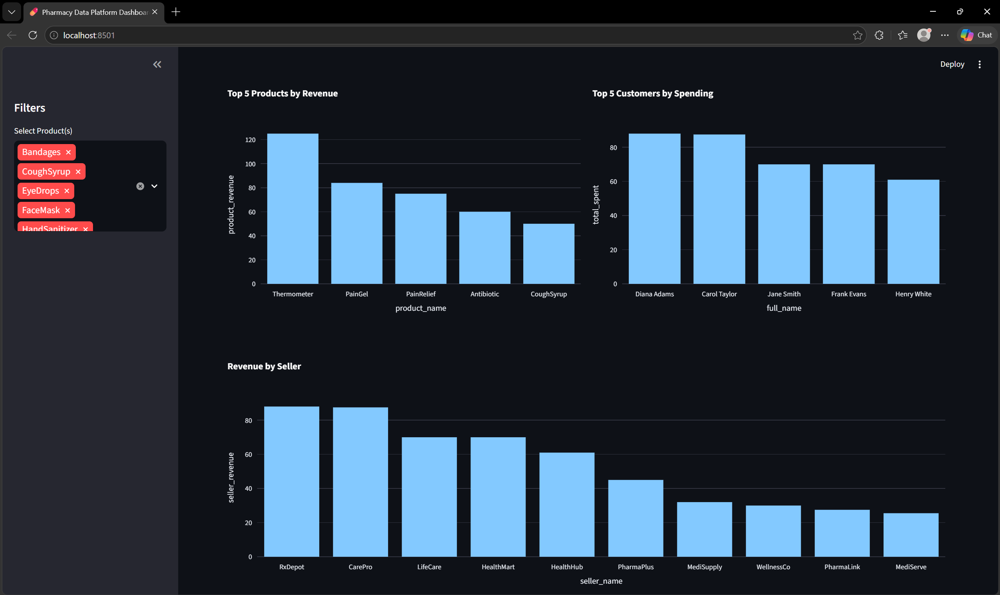
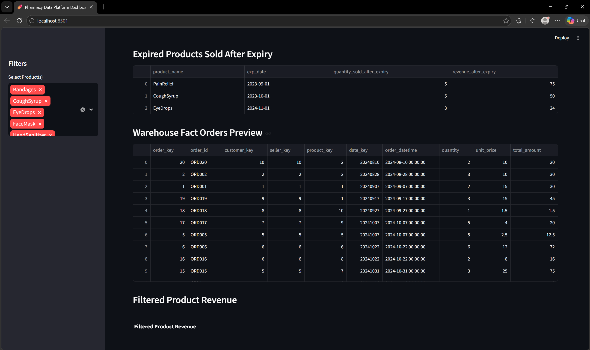
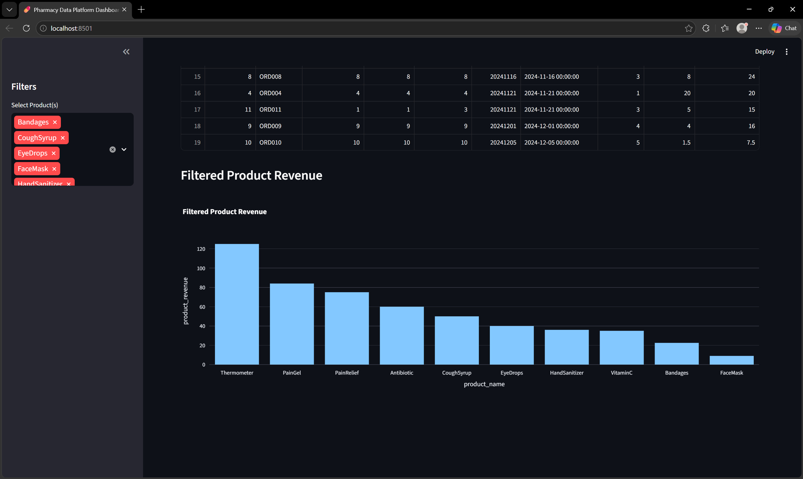

# 💊 Pharmacy Data Platform

An end-to-end data engineering project that transforms a transactional pharmacy database into an analytics-ready data warehouse with an interactive dashboard.

---

## 🚀 Project Overview

This project simulates a real-world data engineering pipeline:

- Designed a normalized OLTP schema for pharmacy operations
- Built ETL pipelines to transform transactional data
- Created a star-schema data warehouse
- Developed analytical queries for business insights
- Built an interactive dashboard using Streamlit

---

## 🧱 Architecture

Source Database (OLTP)
→ Python ETL Pipeline
→ Data Warehouse (Star Schema)
→ Analytics Queries
→ Streamlit Dashboard

---

## 🗄️ Data Model

### Source Tables
- Customer
- Seller
- Product
- Inventory
- Orders
- Insurance

### Warehouse Tables
- dim_customer
- dim_seller
- dim_product
- dim_date
- fact_orders

---

## ⚙️ Tech Stack

- PostgreSQL
- Python (pandas, SQLAlchemy)
- Streamlit
- Plotly
- SQL

---

## 📊 Dashboard Features

- Total Revenue and KPI metrics
- Monthly revenue trends
- Top products and customers
- Seller performance
- Expired product sales analysis
- Interactive filtering

---

## 📊 Dashboard Preview

### 🏠 Dashboard Overview (KPIs + Revenue Trend)


### 📈 Top Products, Customers & Seller Revenue


### ⚠️ Expired Products & Warehouse Data Preview


### 📊 Product Revenue Analysis (Filtered View)


---

## 🚀 How to Run

### 1. Clone repo

```bash
git clone https://github.com/your-username/pharmacy-data-platform.git
cd pharmacy-data-platform
